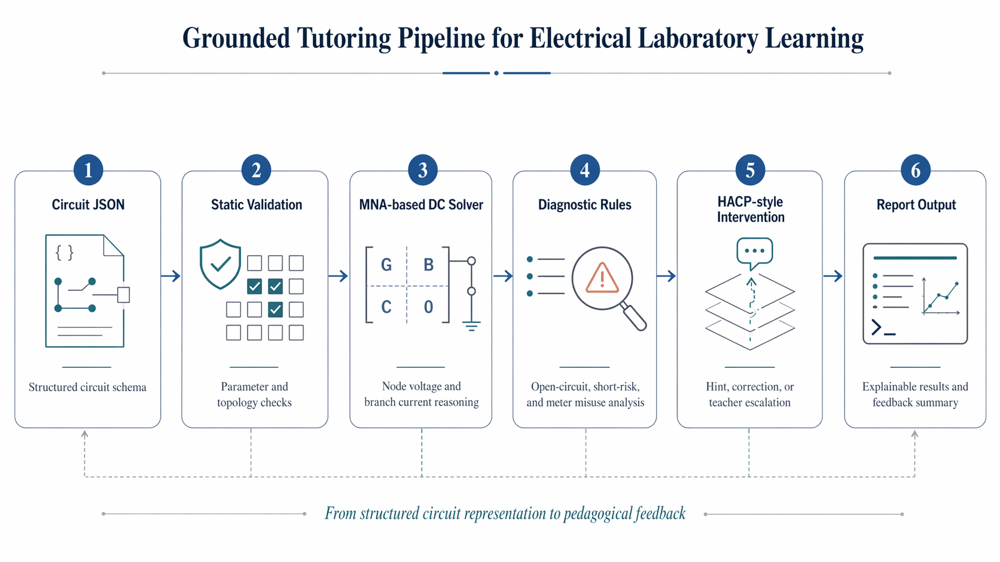

# Grounded Multimodal Agentic Tutoring for Electrical Laboratory Learning

<p align="left">
  <a href="https://github.com/handsomeZR-netizen"></a>
  
  
  
  
  
  
  
  
  
  
  
</p>

> 一个面向电学实验智能教学研究的核心算法原型，将结构化电路表示、MNA 直流求解、错误诊断与 HACP 风格教学干预压缩进同一条可运行闭环。

**English Overview.**  
This prototype distills the algorithmic spine of an ongoing research direction on grounded multimodal tutoring for electrical laboratory learning. Rather than presenting a full application stack, it isolates the part that matters most for technical credibility: structured circuit representation, MNA-based DC reasoning, process-aware error diagnostics, and staged pedagogical feedback. The result is a compact but expressive demo that connects simulation, diagnosis, and instructional intervention inside one reproducible workflow.

## Research Framing

电学实验中的关键困难并不只是“把电路算出来”，而是如何在实验过程里持续回答三个问题：

- 学生当前搭建的电路到底处于什么状态
- 这个状态对应的是参数问题、接线问题，还是测量策略问题
- 系统应该给出启发式引导、直接纠错，还是把问题升级为教师介入

`03_core_algorithm/` 聚焦的就是这条研究链路中的算法核心。它来自更大的研究方向：

**Grounded Multimodal Agentic Tutoring for Electrical Laboratory Learning**

在这个方向里，电路状态感知、仿真验证和教学策略不是彼此割裂的模块，而是一个连续决策过程。这个目录抽离出其中最容易被复现、最适合被审阅、也最能体现技术主张的部分：从电路 JSON 出发，进入可解释的物理解算，再落到教学可用的干预建议。

## Why This Is More Than a Circuit Solver

很多电路 demo 只停留在数值计算层面，而这个原型刻意把“教学语义”引入求解闭环：

- **Structured representation first**: 用统一 JSON 表达电源、负载、开关和仪表连接关系，方便规则分析与后续多模态对齐。
- **MNA-based reasoning**: 不是只做经验规则匹配，而是保留明确的节点电压、支路电流和电压降计算链路。
- **Pedagogical diagnostics**: 错误分析不是纯工程告警，而是针对开路、短路风险、仪表误接等课堂高频问题构造解释。
- **Intervention policy output**: 输出不仅有错误码，还包含启发式提示、直接纠错和教师介入建议，形成教学上可执行的反馈层。

## Core Capabilities

- **Minimal circuit schema**
  - 支持 `voltage_source`、`resistor`、`switch`、`ammeter`、`voltmeter`
  - 采用节点式 `netlist` 风格表示，适合规则诊断与后续扩展
- **MNA-based DC solver**
  - 支持基础串联、并联与简单多节点直流网络
  - 输出节点电压、元件电流、元件电压降、功率信息
- **Rule-grounded diagnostics**
  - 检测开路、短路风险、仪表接法异常、参数异常、悬空节点
- **HACP-style teaching feedback**
  - 输出启发式提示、直接纠错、教师介入建议三层干预
- **Reproducible CLI workflow**
  - 通过单条命令读取样例、完成求解、打印错误分析与教学建议

## Pipeline

<p align="center">
  
</p>

<p align="center">
  <em>Figure 1. A grounded tutoring pipeline that links structured circuit representation, physical reasoning, pedagogical diagnostics, and intervention output.</em>
</p>

这个流程保持了研究原型应有的紧凑性：每一步都足够独立，便于单独审阅；同时每一步都向下一步提供结构化中间表示，避免“会算但不会解释”或“会提示但缺少物理依据”的断层。

## Quickstart

```bash
cd 03_core_algorithm
python -m src.cli --input examples/series_ok.json
```

输出机器可读 JSON：

```bash
python -m src.cli --input examples/series_ok.json --json
```

在检测到错误级问题时返回非零退出码：

```bash
python -m src.cli --input examples/short_risk.json --fail-on-error
```

运行测试：

```bash
pytest
```

## Example Scenarios

### 1. Normal Series Circuit

- 文件: [`examples/series_ok.json`](examples/series_ok.json)
- 展示重点: 最小闭环求解、节点电压、支路电流
- 适合观察: `Solver Summary`、`Node Voltages`、`Element Measurements`

### 2. Open-Circuit Diagnosis

- 文件: [`examples/open_switch.json`](examples/open_switch.json)
- 展示重点: 开关断开后系统如何把“物理不可导通”转成“教学可解释反馈”
- 适合观察: `OPEN_CIRCUIT` 诊断码与启发式提示

### 3. Meter Miswiring Detection

- 文件: [`examples/ammeter_parallel_error.json`](examples/ammeter_parallel_error.json)
- 展示重点: 电流表并联错误的检测与纠正建议
- 适合观察: 从诊断规则到直接纠错的映射

更多样例见 [`examples/`](examples/) ，包括并联网络、短路风险和电压表串联错误。

## Minimal Circuit Schema

顶层字段：

- `name`: 电路名称
- `description`: 电路说明
- `ground`: 参考地节点名，通常为 `gnd`
- `components`: 元件列表

元件字段：

- `id`: 唯一标识
- `type`: 元件类型
- `name`: 展示名称
- `nodes`: 两端节点，例如 `["n1", "gnd"]`
- `params`: 参数字典

支持类型：

- `voltage_source`
- `resistor`
- `switch`
- `ammeter`
- `voltmeter`

示例：

```json
{
  "name": "Normal Series Circuit",
  "description": "12V source driving a 100-ohm load",
  "ground": "gnd",
  "components": [
    {
      "id": "V1",
      "type": "voltage_source",
      "name": "DC Source",
      "nodes": ["n1", "gnd"],
      "params": {"voltage": 12.0}
    },
    {
      "id": "R1",
      "type": "resistor",
      "name": "Load Resistor",
      "nodes": ["n1", "gnd"],
      "params": {"resistance": 100.0}
    }
  ]
}
```

## Technical Notes

### MNA Solver

`src/mna_solver.py` uses a compact Modified Nodal Analysis formulation:

- 电阻、闭合开关、电流表、电压表按等效电阻支路进行 stamping
- 独立电压源通过扩展未知量进入 MNA 系统
- 开路开关采用超大电阻近似
- 理想电流表采用超小内阻近似
- 理想电压表采用超大内阻近似

### Diagnostics Layer

`src/validators.py` 负责静态合法性检查，`src/diagnostics.py` 负责结构级错误识别：

- 开路
- 短路风险
- 电流表并联
- 电压表串联
- 参数异常
- 悬空节点

### Teaching Intervention Layer

`src/intervention.py` 输出三层反馈：

- `heuristic_hints`
- `direct_fixes`
- `teacher_actions`

这使得求解器的输出不止停留在“算对/算错”，而能继续过渡到课堂中的下一步决策。

## Project Layout

```text
03_core_algorithm/
├─ README.md
├─ DEMO_GUIDE.md
├─ examples/
├─ src/
└─ tests/
```

关键入口：

- [`src/cli.py`](src/cli.py): CLI 入口
- [`src/mna_solver.py`](src/mna_solver.py): MNA 直流求解
- [`src/diagnostics.py`](src/diagnostics.py): 规则诊断
- [`src/intervention.py`](src/intervention.py): 教学反馈生成
- [`DEMO_GUIDE.md`](DEMO_GUIDE.md): 演示与展示建议

## Roadmap

- Extend the solver from DC steady-state circuits to richer laboratory scenarios.
- Introduce broader component coverage while preserving explainability.
- Connect this algorithmic core to multimodal observation signals and interaction traces.
- Refine the intervention policy from rule-based v1 toward stronger human-AI complementarity logic.

## Limitations

- 当前仅支持直流稳态分析
- 当前聚焦两端线性器件和基础网络
- 教学策略是规则版 HACP 风格原型，而非完整自适应教学系统
- 暂不支持受控源、电容、电感、交流分析、瞬态分析
- 暂不兼容旧 GUI 系统的 `.circuit` 文件格式

## Related Files

- [`DEMO_GUIDE.md`](DEMO_GUIDE.md): 演示顺序、截图建议与讲解逻辑
- [`tests/`](tests/): 数值正确性、诊断规则和 CLI 烟雾测试
- [`examples/`](examples/): 正常样例与错误样例集合

## Attribution

**Research direction:** Grounded Multimodal Agentic Tutoring for Electrical Laboratory Learning  
**Focus:** circuit-state reasoning, pedagogical diagnostics, and intervention policy design  
**Author context:** Xu Zirui · Nanjing Normal University
